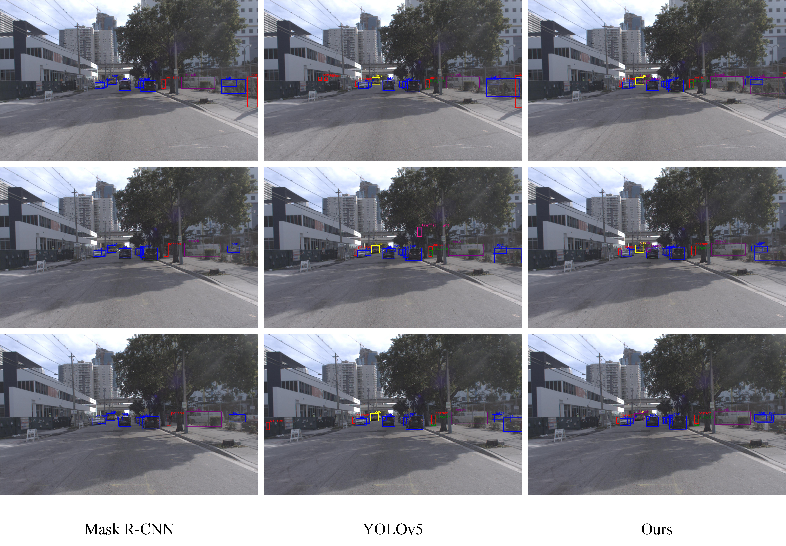
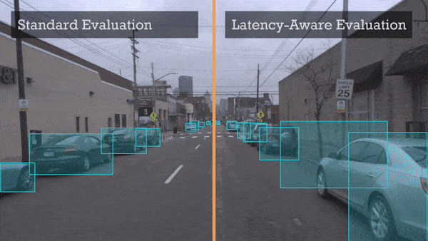

# Real-time Streaming Perception System for Autonomous Driving 
# [[中国自动化大会2021]](https://ieeexplore.ieee.org/document/9728221)

## 方法总览
目标检测技术是提高自动驾驶系统感知能力的关键。然而，过去的目标检测模型在实时驾驶场景下无法达到令人满意的性能，因此我们面向驾驶场景构建了一种实时视频流感知方法。选择YOLOv5作为基线模型，通过在骨干网络末端引入Transformer，以较低开销增强模型的全局感知能力，然后将丰富的全局语义特征输入PANet，对各尺度特征图进行增强。在进一步结合大量训练技巧后，所提方法能以可忽略不计的额外推理成本显著提高流目标感知精度。

## 待办事宜
- [x] 进行效果展示。 [2022-06]
- [ ] 开源训练代码。 [to be confirmed]

## 检测结果
<div align="center">
  
</div>
<br>

**Fig:** 检测结果对比

<div align="center">
  
</div>
<br>

**Video:** 检测结果对比

## 展示海报
<div align="center">
  
</div>
<br>

## 消融实验
<table>
    <tr>
        <td align="center">数据重采样</td>
        <td align="center">结构重参数化</td>
        <td align="center">Transformer</td>
        <td align="center">Lookahead</td>
        <td align="center">离线AP </td>
    </tr>
    <tr>
        <td align="center"></td>
        <td align="center"></td>
        <td align="center"></td>
        <td align="center"></td>
        <td align="center">29.7 </td>
    </tr>
    <tr>
        <td align="center">yes</td>
        <td align="center"></td>
        <td align="center"></td>
        <td align="center"></td>
        <td align="center">30.8 </td>
    </tr>
    <tr>
        <td align="center"></td>
        <td align="center">yes</td>
        <td align="center"></td>
        <td align="center"></td>
        <td align="center">31.7 </td>
    </tr>
    <tr>
        <td align="center"></td>
        <td align="center"></td>
        <td align="center">yes</td>
        <td align="center"></td>
        <td align="center">32.2 </td>
    </tr>
    <tr>
        <td align="center"></td>
        <td align="center"></td>
        <td align="center"></td>
        <td align="center">yes</td>
        <td align="center">30.1 </td>
    </tr>
</table>

## 联系方式
如果您有任何问题，请联系我们 `guyongxiang19@mails.ucas.ac.cn` (我们强烈建议在本项目下打开新的问题，因为你的问题有可能帮助到其他人)。 

## 引用
如果您引用了本文的研究成果，请按照如下格式引用我们的工作。
```
@article{gu2022real-time,
  title={Real-time streaming perception system for autonomous driving},
  author={Gu Yongxiang and Wang Qianlei and Qin Xiaolin},
  journal={2021 China Automation Congress},
  year={2022}
}
```

## 致谢
感谢中科院成都计算机应用研究所-自动推理实验室的同学们在该项工作中的帮助。

